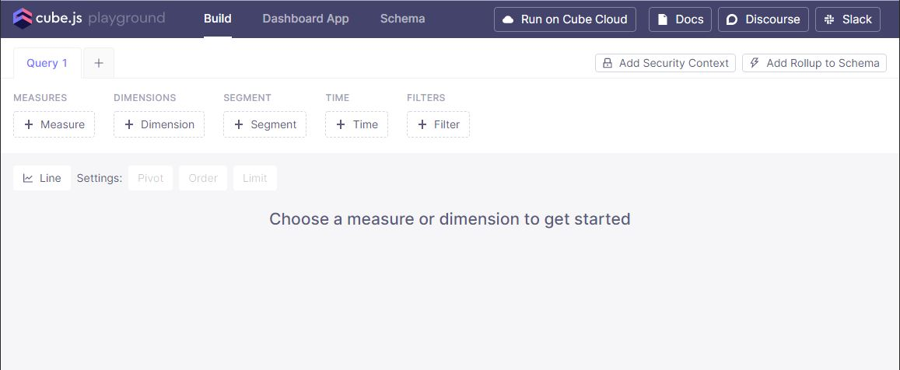
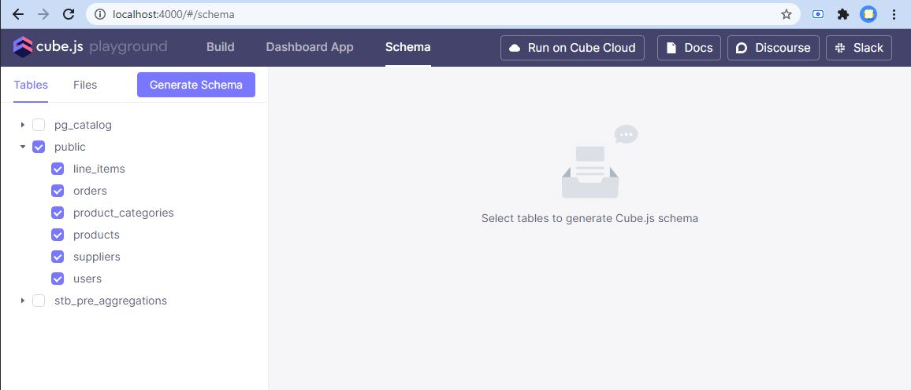
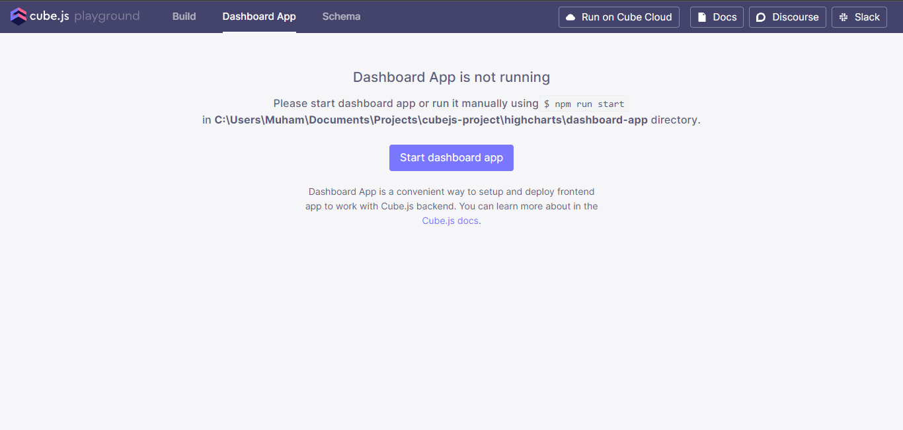
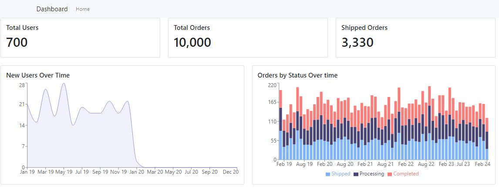
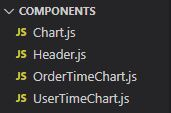

# **Ecommerce Analytics Dashboard with Cubejs and React Recharts**

In this tutorial we are going to build a simple e-commerce dashboard with Cube.js and Recharts.

## **Prerequisites**

-  Docker
-  Docker Compose
-  Node
-  Database (we will use PostgreSQL) with sample data
-  Cube.js backend to handle communications between database and frontend
-  Frontend application (we will build one with React)

## **Overview**

To get this demo you will need to have Node and npm installed on your machine. The instructions to setup Node and npm can be found online.


## **Implementation**

1. Clone the repository & open the repository root directory in terminal.

2. Run the below command to install cubejs-cli

```
npm -g install cubejs-cli
```

3. Next run the below npm command to install the dependencies listed in the package.json file

```
npm install
```

4. Next update as necessary the `.env` file in the project root directory with your database configurations. Current configurations are set to support postgres database defined in docker-compose.yml. Don't forget to add .env to gitignore when deploying

5. Now, let’s start with the Cube.js backend. At this step, you can find the Cube.js playground at http://localhost:4000.

```
npm run dev
```



6. To setup the required demo database and tables execute the following commands.

```
createdb ecom
psql --dbname ecom -f ecom-dump.sql
```

7. On successful setup and connection the database tables will be visible inside the schema tab. You can generate the table schema files as show:
   

8. If you want you can play around with build and schema option in the UI. Now Moving on to the setup instructions for the react frontend. First execute the below commond to install the frontend dependencies.

```
cd dashboard-app
npm install
```

9. To start the react front end you can either click the `Start Dashboard` button or execute the command below:

```
npm run start
```



10. If you have followed along the guide correctly you will have the dashboard up and running by now. The dashboard can be accessed at http://localhost:3000



11. Additionally if you are interested in running the application on docker. Then follow along by first terminating the currently running instance of the application.

12. The first thing is to revert any changes made to the `.env` file in the project root. The `.env` file database configuration should match the postgres configurations inside `docker-compose.yml`

```
version: '3'

services:
  postgres:
    container_name: postgres
    image: postgres:latest
    ports:
      - 5432:5432
    environment:
      POSTGRES_USER: postgres
      POSTGRES_PASSWORD: postgres
      POSTGRES_DB: ecom
    volumes:
      - ./ecom-dump.sql:/ecom-dump.sql

  cube:
    container_name: cube
    image: cubejs/cube:latest
    ports:
      # It's better to use random port binding for 4000/3000 ports
      # without it you will not able to start multiple projects inside docker
      - 4000:4000  # Cube.js API and Developer Playground
      - 3000:3000  # Dashboard app, if created
    env_file: .env
    volumes:
      - .:/cube/conf
      # We ignore Cube.js deps, because they are built-in inside the official Docker image
      - .empty:/cube/conf/node_modules/@cubejs-backend/
    depends_on:
      - postgres
```

13. Next execute the following command to start the containers

```
docker compose up -d
```

14. Once the containers have been started you can access the cubejs server at http://localhost:4000

15. In order to setup the database and required tables execute this command in a new terminal window.

```
docker exec postgres bash -c "psql --db ecom -f ecom-dump.sql -U postgres"
```

16. Use the dashboard menu `Start Dashboard` button to start the react frontend. Frontend will be accessible at http://localhost:3000

17. You can add, modify and delete charts by refering the to [Recharts docs](https://recharts.org/en-US/). Any modifications necessary Can be made inside the components folder and use them anywhere necessary.



## **Conclusion**

If you’ve followed the above steps, then you’ve now created, configured, and started a Dashboard Application using Cubejs and you’re well on your way to taking full advantage of Cubejs as a solution to a variety of dashboarding needs.
